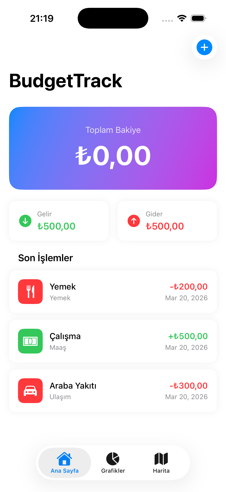
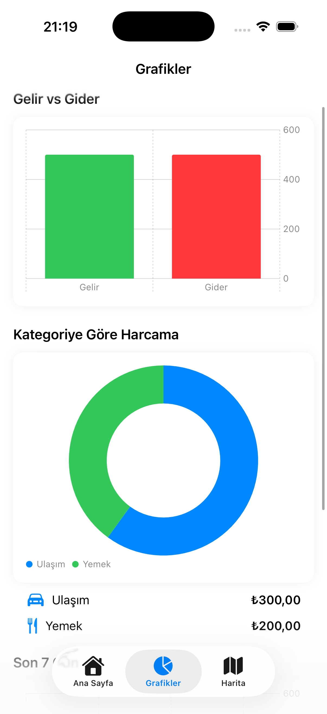
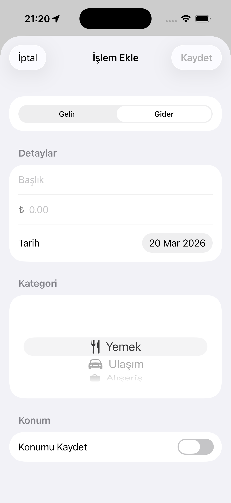
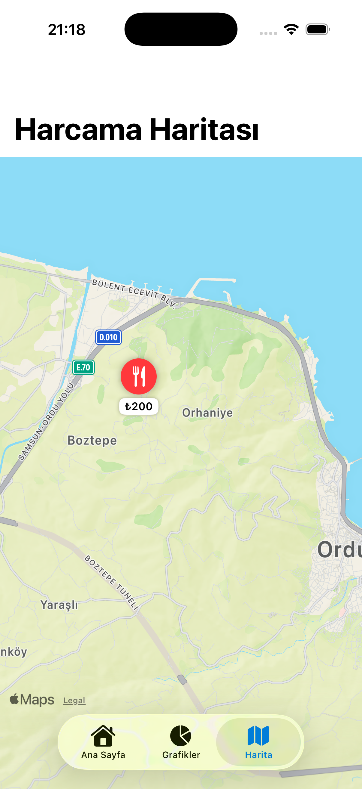

# BudgetTrack 💰

A modern iOS budget and finance tracking app built with SwiftUI, Firebase, and Swift Charts.

## Features
- 💳 Income & expense tracking
- 📊 Visual charts with Swift Charts (bar, pie, line)
- ☁️ Real-time cloud sync with Firebase Firestore
- 🗂️ Category-based organization
- 📅 Date-based filtering
- 🗺️ Location tagging with MapKit (coming soon)

## Tech Stack
- **SwiftUI** — Modern declarative UI
- **Firebase Firestore** — Real-time cloud database
- **Swift Charts** — Native data visualization
- **MVVM Architecture** — Clean, testable code
- **Swift Concurrency** — async/await

## Screenshots

<p float="left">
  
  
  
  
</p>


## Requirements
- iOS 17+
- Xcode 15+
- Swift 5.9+

## Installation
1. Clone the repo
```bash
   git clone https://github.com/52BaranHaydar/BudgetTrack.git
```
2. Open `BudgetTrack.xcodeproj` in Xcode
3. Add your `GoogleService-Info.plist`
4. Build and run

## Author
**Baran Haydar** — Computer Engineering Student  
[LinkedIn](https://www.linkedin.com/in/baranhaydar) · [GitHub](https://github.com/52BaranHaydar)
